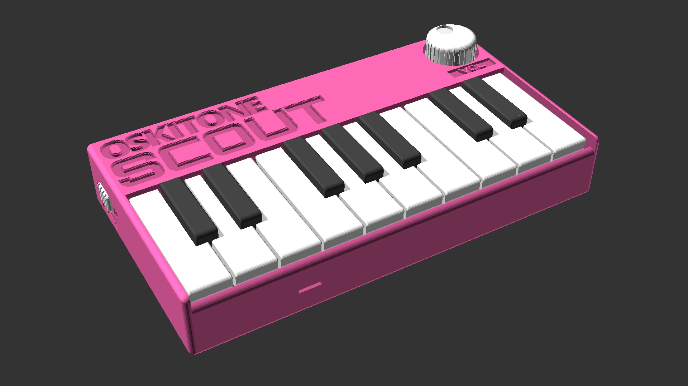

# Scout

**Work-In-Progress!** PCBs are done (I hope!), but enclosure is still baking and I need to write up proper documentation. Stay tuned.

---

**scout** (_/skout/_):

1. _One sent to obtain information_
2. _Jean Louise “Scout” Finch, of Atticus Finch_
3. _The first synth from Oskitone to venture into the big ol' world of microcontrollers_

The Scout is:

- **Hackable:** Powered by an ATmega328 and can be re-programmed just like an Arduino Uno using an [FTDI Serial TTL-232 cable](https://www.adafruit.com/product/70). And fully open source!
- **3D-Printable:** Besides the electronics and some common nuts and bolts, all parts can be 3D-printed. And with a width of ~160mm (about 6.3"), the Scout can fit on smaller, "mini" print beds.
- **Minimally featured:** Monophonic square wave with fixed glide and octave. 1.5 octaves of keys, a volume knob, on/off switch, headphone jack. No MIDI/CV or other IO.
- **Beginner-friendly:** All through-hole components for soldering and assembles in about 45min. Standalone, battery-powered, doesn't need a computer or external speakers to work. Fun!

## Goals

In addition to the Scout being the first microcontroller-controlled instrument from Oskitone, it would also make a fine first DIY instrument for the budding electronics hobbyist.

As such, its design is guided by a metric I'm calling "Time-to-Noise" (TTN): the time it takes from starting the kit to making music with it. The lower the better.

- Minimum number of components for reduced assembly time
- Able to print on "mini" (18x18x18cm) sized 3D printers
- Built-in speaker
- Minimum number of notes
- Volume control

~Any secondary features should be optional; circuit must function w/o them:~

- ~Line-out jack~ _Eh, easier said than done_
- ~Octave control~ _Removed!_

## Annotated BOM

Based on KiCad board BOM, with non-essential footprints removed and usages explained.

| Designator | Designation        | Quantity | Marking              | Usage                                               |
| ---------- | ------------------ | -------- | -------------------- | --------------------------------------------------- |
| BT1        | 4.5v               | 1        | n/a                  | Power; wires to 3\*AAA battery pack                 |
| C1,C5      | 220uF              | 1        | n/a                  | Big bypass cap, Amp output                          |
| C3         | 1uF                | 1        | n/a                  | Amp gain                                            |
| C2,C4,C6   | .1uF               | 3        | 104                  | Bypass caps, RESET pin cap (C4)                     |
| D1         | LED_CRGB           | 1        | n/a                  | On/off+playing indicators                           |
| J1         | AudioJack2_SwitchT | 1        | n/a                  | Line out headphone jack                             |
| J2         | Conn_01x06_Male    | 1        | n/a                  | Programming header                                  |
| LS1        | Speaker            | 1        | n/a                  | Wires to output speaker                             |
| R1,R2,R3   | 220                | 3        | Red Red Brown        | LED current limiters                                |
| R4         | 1k                 | 1        | Brown Black Red      | Brings volume closer to ear-safe level for line out |
| R5         | 330k               | 1        | Orange Orange Yellow | Drops volume even more before amp                   |
| R6         | 10k                | 1        | Brown Black Orange   | "Pull up" resistor for RESET pin                    |
| RV1        | 10k Log            | 1        | n/a                  | Volume control                                      |
| SW1        | SW_SPST            | 1        | n/a                  | On/off power switch                                 |
| SW2-SW18   | SPST               | 17       | n/a                  | Key buttons                                         |
| U1         | ATmega328P-PU      | 1        | n/a                  | Microcontroller chip                                |
| U2         | LM386              | 1        | n/a                  | Amplifier chip                                      |
| Y1         | 16.00MHz           | 1        | 160B                 | Ceramic oscillator for microcontroller              |

Also:

- 10" wire
  - BT1 6"
  - LS1 4"
- Battery terminal contacts for BT1
  - 2 dual spring+button wire contacts
  - 1 tabbed spring contact
  - 1 tabbed button contact
- 2 sockets
  - 1 28 pin for U1
  - 1 8 pin for U2

## License

Designed by Oskitone. Please support future synth projects by purchasing from [Oskitone](https://www.oskitone.com/).

Creative Commons Attribution/Share-Alike, all text above must be included in any redistribution. See license.txt for additional details.
