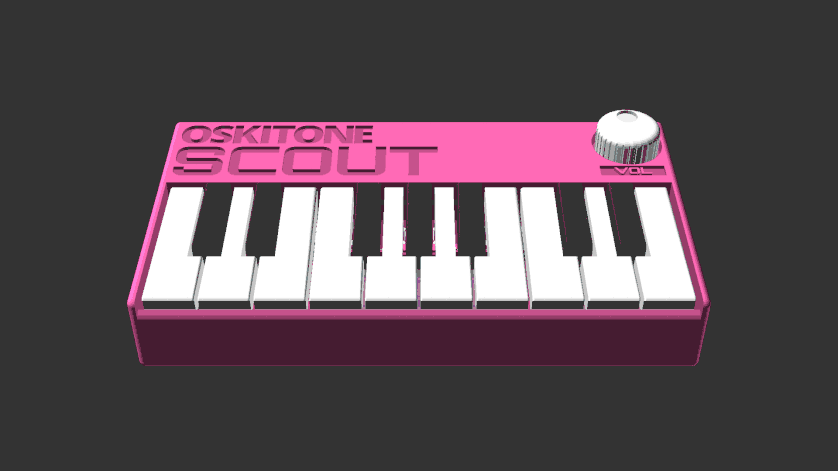

# Scout

**scout** (_/skout/_):

1. _One sent to obtain information_
2. _Jean Louise “Scout” Finch, of Atticus Finch_
3. _The first synth from Oskitone to venture into the big ol' world of microcontrollers_

The Scout is:

- **Beginner-friendly:** All components are through-hole (instead of surface mount) for easier soldering, and full assembly takes about 45min. Standalone, battery-powered, doesn't need a computer or external speakers to work. Fun!
- **3D-Printable:** Besides the electronics and nuts and bolts, all parts are 3D-printed. And with a total width of ~160mm (about 6.3"), the Scout can fit on smaller, "Mini" (18x18x18cm) size print beds.
- **Hackable:** Arduino-compatible and fully open source! Hook up an [FTDI Serial TTL-232 cable](https://www.adafruit.com/product/70) (sold separately) to update its code using the Arduino IDE.
- **Minimally featured:** 1.5 octaves of keys, a volume knob, on/off switch, speaker, headphone jack. Monophonic square wave with fixed glide and octave.

In addition to it being the first microcontroller-controlled instrument from Oskitone, the Scout would also make a fine introductory DIY instrument for the budding electronics hobbyist. (Some experience soldering and a general familiarity with how electricity works are recommended though!)

As such, it is intentionally minimal, with the goal of the shortest possible time from starting the kit to making music with it. No MIDI/CV or other IO, as is. If you're looking for a full-featured studio instrument, this ain't it, bub! :)

**Demo:** [https://vimeo.com/587660426](https://vimeo.com/587660426) 
**Purchase a kit:** [https://www.oskitone.com/product/scout-synth-diy-electronics-kit](https://www.oskitone.com/product/scout-synth-diy-electronics-kit) 
**Assembly guide:** [https://oskitone.github.io/scout/](https://oskitone.github.io/scout/) 
**Blog post:** [https://blog.tommy.sh/posts/scout/](https://blog.tommy.sh/posts/scout/)

## 3D Models

The Scout's 3D-printed models are written in OpenSCAD.

### Dependencies

Assumes `poly555` and `apc` repos are in a sibling directory and are _both up to date_ on the `main` branch. Here's how I've got it:

    \ oskitone
        \ apc
        \ poly555
        \ scout

You'll also need to install the [Orbitron](https://fonts.google.com/specimen/Orbitron) font.

### Building

STLs are generated with `make_stls.sh`. Run `./make_stls.sh -h` for full flags list.

### Changelog

- **September 6, 2021:** Loosen knob fit on pot shaft (6cce7a7)
- **August 9, 2021:** Init (9b5ffe5)

## License

Designed by Oskitone. Please support future synth projects by purchasing from [Oskitone](https://www.oskitone.com/).

Creative Commons Attribution/Share-Alike, all text above must be included in any redistribution. See license.txt for additional details.
